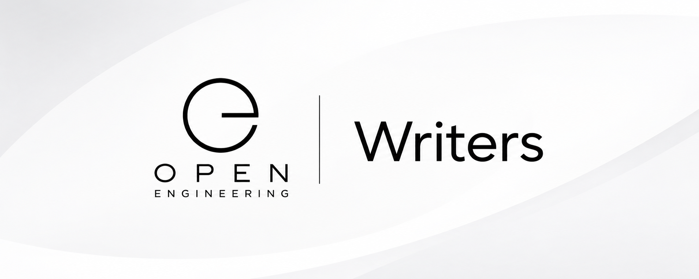

# Open Engineering Writers

Writing the Open Engineering ecosystem into existence.

Open Engineering Writers is the writing and publishing capability of the Open Engineering ecosystem.

We explore how humans and AI can work together to create engineering documentation, technical narratives, specifications, reports, stories, articles, and other forms of durable knowledge.

Writing is not merely the final presentation layer of engineering. It is part of engineering itself.

## What we do

Open Engineering Writers provides a home for experiments, tools, conventions, workflows, and reusable capabilities around engineering writing.

We work across the full journey from:

idea → investigation → understanding → structure → writing → review → publication → reuse

This includes:

* Technical documentation
* Architecture descriptions
* Engineering specifications
* Investigation reports
* Research notes
* Design documents
* Tutorials and educational material
* Articles and essays
* Project narratives
* Stories and scripts
* AI-assisted writing workflows
* Human–AI collaborative writing
* Writing conventions and reusable patterns

Writing as an Engineering Capability

Open Engineering treats writing as an engineering capability, rather than an isolated communications activity.

A good engineering artifact makes knowledge:

* understandable
* traceable
* reusable
* maintainable
* verifiable
* discoverable

The writer therefore becomes part investigator, part engineer, part editor, and part storyteller.

AI can participate in every part of this process — but the goal is not to replace the writer.

The goal is to create a better human–AI writing system.

From Source to Story

Open Engineering Writers connects engineering evidence with human-readable communication.

A typical flow can look like:

Sources
   ↓
Observations
   ↓
Investigation
   ↓
Evidence
   ↓
Understanding
   ↓
Structure
   ↓
Writing
   ↓
Review
   ↓
Publication
   ↓
Knowledge

The resulting artifacts can then become inputs for other parts of the ecosystem.

Documentation can become architecture knowledge.

Investigations can become stories.

Stories can become educational material.

Specifications can become implementations.

And implementations can generate new evidence.

AI-Assisted Writing

We experiment with tools and workflows that make AI a genuine writing partner.

This includes:

* transcription → writing
* research → synthesis
* source material → drafts
* notes → structured documents
* engineering repositories → documentation
* conversations → reusable knowledge
* diagrams → explanations
* investigations → reports
* stories → scripts
* drafts → editorial refinement

The writer remains responsible for intent, judgement, meaning, and truth.

AI provides leverage.

Writing Tools

Open Engineering Writers can integrate with external and open-source writing technologies where they provide useful capabilities.

Tools are treated as capabilities, not dependencies of the ecosystem.

A tool can be replaced when a better capability becomes available.

Part of Open Engineering

Open Engineering Writers is one element of a larger ecosystem of engineering capabilities.

It connects naturally with:

* Open Engineering Transcriptions — turning speech into source material
* Open Engineering Documentation — producing and maintaining engineering documentation
* Open Engineering Stories — developing narrative structures
* Open Engineering Motion Pictures — turning stories into audiovisual experiences
* Open Engineering Academy — turning knowledge into learning experiences
* Open Engineering Architecture — communicating systems and architectural decisions
* Open Engineering Investigations — transforming evidence into understanding

The boundaries between these capabilities are intentionally permeable.

Our Philosophy

Write to understand

Writing is a method of thinking.

Make knowledge reusable

A document should become an asset, not a dead end.

Preserve provenance

Important claims should be traceable to their sources and evidence.

Separate evidence from interpretation

Readers should be able to distinguish what was observed from what was concluded.

Use AI deliberately

AI should amplify human creativity, reasoning, and productivity — not obscure responsibility.

Prefer open systems

Where practical, capabilities should be inspectable, composable, replaceable, and reusable.

The Writer

The Open Engineering Writer is not necessarily a person.

It can be:

* a human
* an AI assistant
* a human–AI team
* an automated workflow
* a combination of all of these

What matters is the quality and provenance of the resulting artifact.

Explore

Open Engineering Writers is an evolving part of the Open Engineering ecosystem.

Explore the repositories, experiments, conventions, tools, and writing workflows that help us answer one question:

How can we engineer better knowledge together?

⸻

Open Engineering Writers
Engineering knowledge, one artifact at a time.
